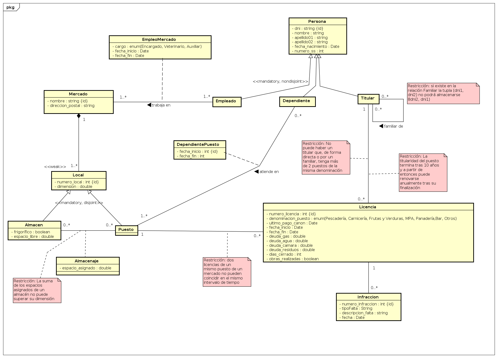

# Food market database

- **create_db.sql**: creates the DB and fills the tables of *enum*.
- **fill_db.sql**: inserts some examples in the DB.
- **client_documentation.pdf**: the official document in which the created DB is based.
- **ER_diagram.png**: the Entity-Relationship diagram of the DB.
- **relational.png**: the relational schema of the DB.

